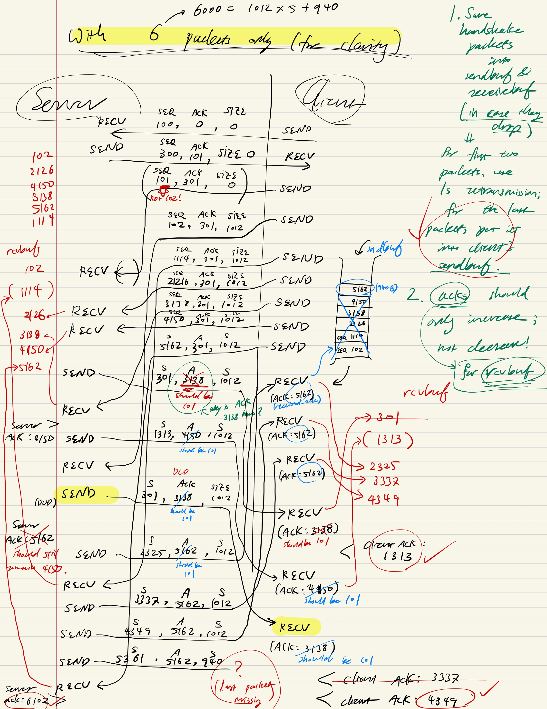
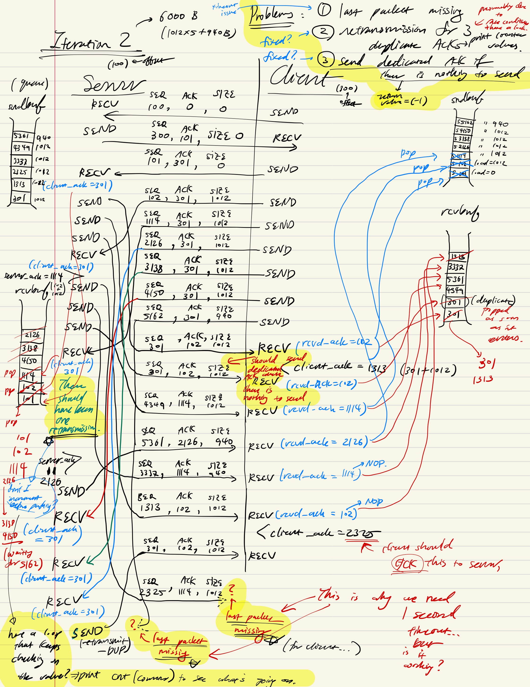
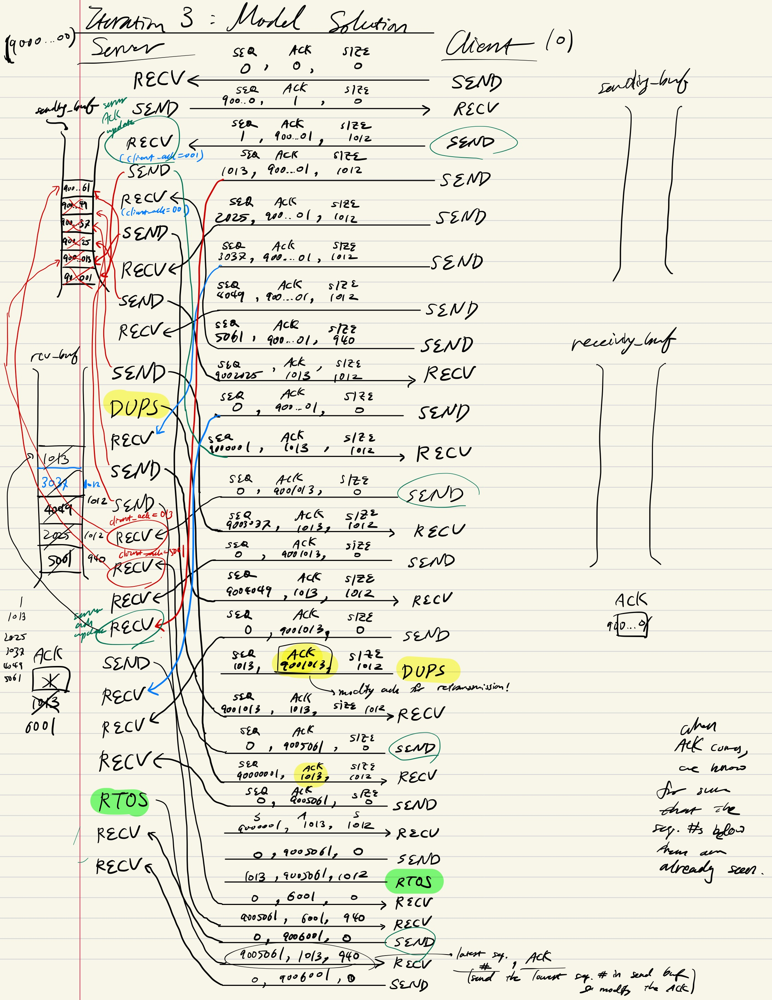

# CS 118 Fall 24 Project 0

This repository contains a reference solution and autograder for [CS 118's Fall 24 Project
0](https://docs.google.com/document/d/1O6IuX39E4PoMvQ9uP98AWayqCgmnoBUoRfKCUZboKwg).


## Part 1. Docker Setup (for Linux users)
Since I was implementing this project in Ubuntu Linux, I had to give 
sudo access to my username to be able to run docker without sudo command. I did the following:

```shell
sudo groupadd docker
sudo usermod -aG docker $USER
newgrp docker
newgrp docker
sudo reboot # reboot the Linux machine to update the change
```
which can also be seen at: https://docs.docker.com/engine/install/linux-postinstall/


## Part 2. How to run
I printed everything out in stderr. Following [Omar Elamri](omar@cs.ucla.edu)'s advice on CampusWire, I ran 

```Docker
make interactive
```
to start the container environment. 

Then, I ran

```python
# in /autograder/source/tests/
python3 -c "import utils; utils.proxy(8080, 8081, 0.05, 1)" &

```
To simulate the packet dropping. Here, 8080 is the client port, 8081 is the server port, 0.05 is the drop rate (5%), and 1 is the reorder rate. I can change this to run different tests.

For detailed view, refer to autograder/source/tests/utils.py

To generate test files, I ran

```shell
# in /autograder/submission/
head -c 500000 /dev/urandom >test.bin
```

which generated 500KB test file. I can change the size of the file by changing the number.

During testing, it is recommended to use small files. For initial debugging, I used 6000B (= 1012 * 5 + 940) which comprises 6 packets for both server and client. This helped me fix the last-packet-missing problem, 

I used tmux to use split screens to analyze the stderr messages for both client and server. We fed in the test.bin into stdin for both programs and outputted the received packets to server.bin for server and client.bin for client.

There was also refserver and refclient in the Docker. I initially used them to test my client and server individually because I ran into problems where my client and server communicates fine but not with the reference client and server.

```shell
# in /autograder/submission/
tmux
../source/src server 8081 <test.bin >server.bin
./client localhost 8080 <test.bin >client.bin
```

I timed myself to run the program for 60s before interruption (Ctrl + C). Then, I tested the outputs by running:
```shell
# in /autograder/submission/
diff3 test.bin client.bin server.bin
```

Which doesn't output anything if all three files have the same content.

If this test fails, I ran 
```shell
diff test.bin client.bin
diff test.bin server.bin
```
to identify which program has not received all the packets.

Keep in mind that if test.bin == client.bin, this indicates that the server is working properly in sending packets. It was important to identify which program is responsible for each bin to investigate the problem.

Currently, all fprintf() statements are commented out except for handshake portion, but in case of future improvement, they must all be uncommented for better visibility of packet buffers and what packets are sent and received. Programming without them would be almost impossible.


## Part 3. Challenges
Some of the major challenges I experienced was: 
1) retransmission logic (especially the timeout)
2) sending dedicated ACK packet if there is nothing to send or sending buffer reached maximum size
3) termination condition so that no packet goes missing ("last-packet-missing")

They were primarily resolved through drawing diagrams (illustrated below) and observing the model behavior of refserver and refclient.


### Retransmission Logic
I initially used clock() from <time.h> but the retransmission was very unorderly. Doing more research, I learned that it was standard practice to use alarm() in <unistd.h> to raise signal asynchronously and handle it using signal() in <signal.h> [reference](https://stackoverflow.com/questions/21542077/c-sigalrm-alarm-to-display-message-every-second). It was more convenient and error-free to implement timeout logic that way (also, in retrospect, it might have also been implied in the spec), so I changed the logic to fix the problem.


### Using ACK and buffer scans
I had to use ACK to pop the sending buffer. When there was ACK, I removed all the packets in the sending buffer that had sequence numbers less than ACK value.

I maintained two buffers--sending and receiving--for both client and server. I used list from C++ STL for convenience.
I could have also used deque since the sliding window buffer for the sending packets is FIFO.

I discovered that linear scan for the receiving buffer must run concurrently with the receiving and sending logics. If the receiving buffer were sorted, this wouldn't be necessary--I could have scanned only when there is a new packet. However, given the extremely out-of-order nature of packet arrivals, I decided that instead of sorting the receiving buffer, I would keep scanning the receiving buffer and pop them every time we see the sequence number that matches the current ACK.

If the ACK asks for a higher sequence value and the sending buffer is empty, (that is, if I cannot send any more values)
then we know that we have reached the end of the program. That is when we can stop sending new packets

After the handshake step, the client and server share the same logic in the while loop since both are symmetrical.

### On the symmetry of logic between server and receiver after handshake
When we copy the while loop over, three things to keep in mind:
- for all the debugging information, change "server" (server.c) <-> "client" (client.c)
- change sequence number variable: server_seq (server.c) <-> client.seq (client.c)
- change target address variable: client_addr (server.c) <-> server_addr (client.c)


### Debugging
Debugging was particularly challenging because both client and server were concurrently sending and receiving packets. I ended up drawing three diagrams: 
1. my server <-> my client
2. my server <-> my client
3. refserver <-> refclient (to observe the behavior of the correct program)

I have attached the pictures for all three in order:
1. my server <-> my client (1st iteration)


2. my server <-> my client (2nd iteration)


3. refserver <-> refclient  



